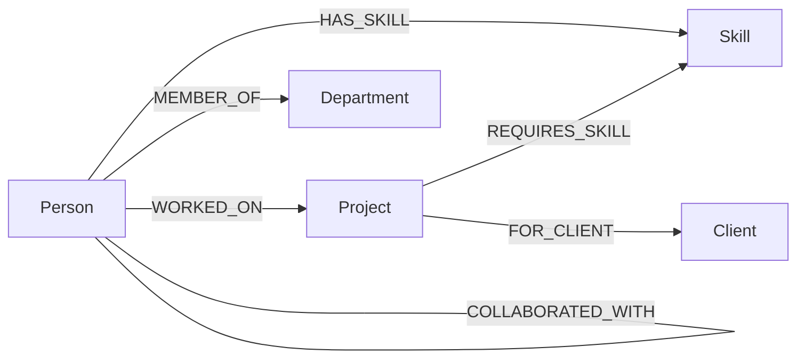

# Staffing Graph — a graph-database staffing recommender

A small web app that helps staff new consulting projects by finding people who have the
right skills **and** are already well-connected — directly or through a mutual
colleague — to the team they'd be joining. Built on **CognoDB** (a managed graph
database speaking openCypher over Bolt) with a **FastAPI** backend and a **React**
frontend.

- **Hosted demo:** _TODO: add your Vercel URL here_
- **Screen recording:** _TODO: add your recording link here_

---

## 1. The use case

Picture a consulting org's staffing desk: a new project needs a data engineer and a
change-management lead. Dozens of people on the bench have those skills on paper. Who
do you actually pick?

In practice, the people who ramp up fastest on a new team are rarely a random pick from
a skills index — they're the ones who've already worked with someone on that team, or
worked with someone who worked with someone on that team. Prior collaboration is a
strong, informal signal of "this will go smoothly": shared context, known working
style, an existing trust relationship.

This app models people, skills, projects, clients and departments as a graph so that
staffing search can reason about *both* qualifications and relationships in a single
query, and surfaces the actual chain of collaboration behind each recommendation.

### Why a graph database?

A relational schema handles "people with skill X" fine — that's one join. It falls
over on the two things that make this use case interesting:

1. **Unbounded-depth relationship traversal.** "Has this candidate worked with anyone
   on the current team, directly or through one intermediate colleague?" is a
   variable-length path query. In SQL it's a recursive CTE over a
   person-to-person bridge table, with manual cycle avoidance and path
   aggregation — doable, but the query gets more convoluted (and slower) the more
   hops you allow. In Cypher it's one pattern:
   `(candidate)-[:COLLABORATED_WITH*1..4]-(teammate)`.
2. **Heterogeneous multi-hop matching in one shot.** Staffing recommendation walks
   `Project → Skill → Person → Person (collaboration) → Project` — four different
   node types chained together. Modeling that relationally means a join across five
   or six tables with compound conditions at each step; in the graph it's a single
   readable `MATCH` pattern (see [Query 1](#query-1) below).

Neither is *impossible* in SQL — but the graph model makes the two questions this app
is actually about (`"who can do this?"` and `"who's already connected to this team?"`)
first-class, native operations instead of query-plan-fighting exercises.

---

## 2. Data model



| Node | Key properties |
|---|---|
| `Person` | `id`, `name`, `title`, `location`, `bio`, `email`, `capacityPct` (0–100, how free they are) |
| `Skill` | `name` (unique), `category` |
| `Project` | `id`, `name`, `description`, `status` (`active`/`completed`/`upcoming`), `startDate`, `endDate`, `domain` |
| `Client` | `id`, `name`, `industry` |
| `Department` | `name` |

| Relationship | Direction | Key properties | What it means |
|---|---|---|---|
| `HAS_SKILL` | Person → Skill | `proficiency` (1–5), `yearsExperience` | What a person can do |
| `WORKED_ON` | Person → Project | `role`, `startDate`, `endDate`, `allocationPct` | Staffing history |
| `REQUIRES_SKILL` | Project → Skill | `minProficiency`, `priority` (`must-have`/`nice-to-have`) | What a project needs |
| `FOR_CLIENT` | Project → Client | — | Project ownership |
| `MEMBER_OF` | Person → Department | — | Org structure |
| `COLLABORATED_WITH` | Person ↔ Person | `projectCount`, `strength` | **Materialized** edge, built by the seed script from people who share a `Project` via `WORKED_ON`. Kept explicit (rather than always recomputed at query time) so path-finding stays fast and so it can be traversed with `*1..4` variable-length patterns. |

---

## 3. Repository structure

```
Staffing Graph/
  backend/     FastAPI app (Python) — REST API over the graph
  frontend/    React + Vite app — the UI
  seed/        Data generation + loading scripts (Faker-based, deterministic)
  README.md
  .env.example
```

---

## 4. Setup

### 4.1 Create the CognoDB instance

1. Sign up at [console.cognodb.com/signup](https://console.cognodb.com/signup) (free, no credit card).
2. From the console, create a free **c0** instance and pick a region — it provisions in under a minute.
3. Copy the **Bolt URI** (`bolt+s://<instance-id>.databases.cognodb.cloud`) and the
   generated password for user `cognodb`. **The password is shown once** — save it
   immediately.

### 4.2 Configure environment variables

Copy `.env.example` to `.env` in the repo root and fill in what you got from the console:

```bash
cp .env.example .env
```

```
NEO4J_URI=bolt+s://<instance-id>.databases.cognodb.cloud
NEO4J_USER=cognodb
NEO4J_PASSWORD=<your-generated-password>
NEO4J_DATABASE=neo4j
ALLOWED_ORIGINS=http://localhost:5173
```

`backend/` and `seed/` both read this file. Never commit it — it's already in
`.gitignore`.

### 4.3 Seed the database

```bash
cd seed
python -m venv .venv && source .venv/bin/activate   # Windows: .venv\Scripts\activate
pip install -r requirements.txt
cd ..
python -m seed.run_seed
```

This generates ~150 people, ~40 skills, ~35 projects across 12 clients, and loads them
with parameterised, batched Cypher (`UNWIND` + `MERGE`, no string-concatenated
queries). It's idempotent — re-running just re-applies the same `MERGE`s. Pass
`--reset` to wipe all nodes first if you want a clean slate:

```bash
python -m seed.run_seed --reset
```

### 4.4 Run the backend

```bash
cd backend
python -m venv .venv && source .venv/bin/activate   # Windows: .venv\Scripts\activate
pip install -r requirements.txt
uvicorn app.main:app --reload
```

The API is now at `http://localhost:8000`. `GET /health` reports whether it can reach
CognoDB.

### 4.5 Run the frontend

```bash
cd frontend
cp .env.example .env   # VITE_API_BASE_URL=http://localhost:8000
npm install
npm run dev
```

Open `http://localhost:5173`.

---

## 5. The main queries, explained

All queries live in [`backend/app/db/queries.py`](backend/app/db/queries.py) and are
always run with parameters via the official `neo4j` driver — never string-concatenated.

### Query 1 — Staffing recommendation (multi-hop traversal) {#query-1}

```cypher
MATCH (proj:Project {id: $projectId})
OPTIONAL MATCH (staffed:Person)-[:WORKED_ON]->(proj)
WITH proj, collect(DISTINCT staffed.id) AS staffedIds
MATCH (proj)-[req:REQUIRES_SKILL]->(skill:Skill)
WHERE req.priority = 'must-have'
MATCH (candidate:Person)-[hs:HAS_SKILL]->(skill)
WHERE hs.proficiency >= req.minProficiency
  AND candidate.capacityPct > 0
  AND NOT candidate.id IN staffedIds
OPTIONAL MATCH (candidate)-[:COLLABORATED_WITH]-(direct:Person)
WITH candidate, skill, staffedIds,
     [x IN collect(DISTINCT direct.id) WHERE x IN staffedIds] AS directHits
OPTIONAL MATCH (candidate)-[:COLLABORATED_WITH]-(bridge:Person)-[:COLLABORATED_WITH]-(indirect:Person)
WHERE bridge <> candidate AND indirect <> candidate
WITH candidate, skill, staffedIds, directHits,
     [x IN collect(DISTINCT indirect.id) WHERE x IN staffedIds AND NOT x IN directHits] AS indirectHits
WITH candidate, collect(DISTINCT skill.name) AS matchedSkills,
     size(directHits) AS directConnections, size(indirectHits) AS indirectConnections
RETURN candidate.id AS personId, candidate.name AS name, candidate.title AS title,
       candidate.capacityPct AS capacityPct, matchedSkills, directConnections,
       indirectConnections, (directConnections * 2 + indirectConnections) AS connectionScore
ORDER BY size(matchedSkills) DESC, connectionScore DESC
LIMIT $limit
```

Plain English: find people who (a) have the project's must-have skills at the required
proficiency, (b) have capacity, and (c) aren't already on the project — then, for each,
count how many of the *current team* they've worked with directly (1 hop through
`COLLABORATED_WITH`) or through one intermediate colleague (2 hops), and rank by skill
match then connection strength. That's a 3-hop traversal (`Skill → Person →
COLLABORATED_WITH → COLLABORATED_WITH → Project`) done as one pattern match.

> **A real CognoDB compatibility quirk, found and worked around:** an earlier version
> of this query filtered "already staffed" and the collaboration counts using
> `NOT EXISTS { MATCH (candidate)-[:WORKED_ON]->(proj) }` and `OPTIONAL MATCH` clauses
> that re-referenced an already-bound target node (`proj`). On this CognoDB instance,
> that pattern silently ignores the property filter on the target and matches *any*
> relationship of that type instead — confirmed by comparing against ground-truth counts
> (e.g. a skill filter that should return 17 people returned all 150; an "already
> staffed" check returned `true` for someone with zero edges to that specific project).
> The fix, shown above: collect the relevant id set once via the one shape that *does*
> correlate correctly (a fresh node discovering paths into an already-bound target,
> e.g. `staffed:Person)-[:WORKED_ON]->(proj)`), then filter everything downstream with
> plain list membership (`x IN list`) instead of relying on further bound-node pattern
> matching. `LIST_PEOPLE`'s skill/department filters needed the same fix.

### Query 2 — Collaboration path (the SQL-awkward one)

```cypher
MATCH (candidate:Person {id: $candidateId})
MATCH (teammate:Person)-[:WORKED_ON]->(:Project {id: $projectId})
WHERE teammate.id <> $candidateId
MATCH path = allShortestPaths((candidate)-[:COLLABORATED_WITH*1..4]-(teammate))
RETURN teammate.id AS teammateId, teammate.name AS teammateName, length(path) AS hops,
       [n IN nodes(path) | n.name] AS pathNames,
       reduce(s = 0, r IN relationships(path) | s + r.projectCount) AS pathStrength
ORDER BY hops ASC, pathStrength DESC
```

This finds the shortest collaboration chain(s) between a candidate and every current
team member, with unknown depth (1 to 4 hops) and cycle-safe shortest-path semantics
built in via `allShortestPaths`. Expressing "shortest path of unknown length between
two nodes in a self-referencing relationship, with a strength aggregate over the
path" in SQL means a recursive CTE with manual visited-node tracking and depth limits
— it's the textbook case where relational engines start fighting the query instead of
just running it. The UI renders this directly as the "how they're connected" chain
under each candidate.

### Other queries

`GET_PERSON_DETAIL` and `GET_PROJECT_DETAIL` pull an entity plus all its immediate
relationships (skills, project history, collaborators / required skills, team) in a
single round trip using `OPTIONAL MATCH` + `collect()`. `LIST_PEOPLE` / `LIST_PROJECTS`
support optional filters via `EXISTS {}` subqueries so a `NULL` filter parameter
means "don't filter," again without any string concatenation.

---

## 6. Architecture

```
React (Vercel) ──HTTP/JSON──▶ FastAPI (Render) ──Bolt (neo4j driver)──▶ CognoDB Cloud
```

- **Backend** (`backend/app/`): `config.py` reads `NEO4J_*` / `ALLOWED_ORIGINS` from
  env vars; `db/driver.py` owns a single driver instance and a session context manager
  that turns connectivity failures into a `DatabaseUnavailableError`; `db/queries.py`
  holds every Cypher string; `services/graph_service.py` runs queries and maps records
  to Pydantic models; `routers/` expose them as REST endpoints; `main.py` registers
  exception handlers so a DB outage returns a clean `503 {"error": "database_unavailable"}`
  instead of a stack trace.
- **Frontend** (`frontend/src/`): `api/` is a typed fetch client per resource;
  `hooks/useApi.ts` standardizes loading/error/data state; `context/AppStatusContext.tsx`
  polls `/health` and drives a persistent "database unreachable" banner; `pages/` and
  `components/` implement Browse People, Browse Projects, and the core Staffing flow.

## 7. Deployment

**Backend → Render**
1. New Web Service → point at this repo, root directory `backend/`, build via the
   included `Dockerfile`.
2. Set env vars: `NEO4J_URI`, `NEO4J_USER`, `NEO4J_PASSWORD`, `NEO4J_DATABASE`,
   `ALLOWED_ORIGINS` (leave permissive until you have the Vercel URL, then tighten it).
3. Note the resulting public URL (`https://<service>.onrender.com`).

**Frontend → Vercel**
1. New Project → root directory `frontend/`, framework preset "Vite."
2. Env var `VITE_API_BASE_URL` = the Render URL from above.
3. Deploy, then go back to Render and set `ALLOWED_ORIGINS` to the real Vercel URL.

## 8. Screenshots

_TODO: add screenshots of Home, People browse, Person detail, Project detail, the
Staffing recommendation list, an expanded collaboration path, and the DB-unreachable
error banner._
